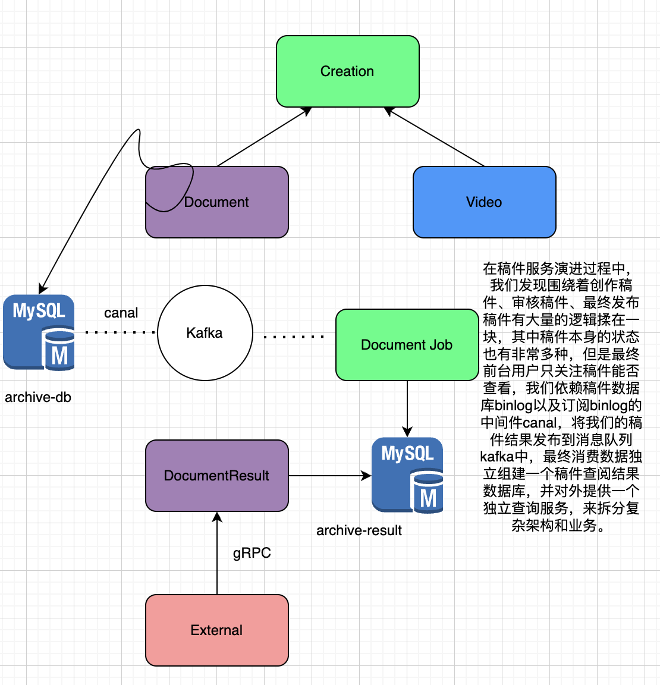

# Microservices
## 微服务概览🌟
- 单体架构😉
    - 尽管在单体架构中也是模块化设计，但是最终会打包并部署为单体式应用。主要的问题是应用过于复杂、应用无法扩展，可靠性低，最终，敏捷性开发和部署无法完成。
    - 化繁为简，分而治之。
- SOA😉
    - 面向服务的架构（SOA）是一种`软件开发方法`，它使用称为`服务`的软件组件来创建业务应用程序。`每项服务提供一种业务能力，并且服务也可以跨平台和语言相互通信`。开发人员使用 SOA 来重用不同系统中的服务，或者组合几个独立的服务来执行复杂的任务。
    - 微服务是SOA的最佳实践。
    - 小即是美：小的服务代码少、Bug少、易于测试、维护、迭代。
    - 单一职责：一个服务只做好一件事情。
    - 提供原型：提供服务API，建立服务契约，达成服务间沟通的一致性约定。
    - 移植性能：可移植性比效率更重要，服务间轻量级通信需要考虑兼容性和移植性。
- Microservices✌️
    - 围绕业务功能构建的、业务功能单一的服务组件，服务之间采用轻量级通信机制，可以达到全自动部署，可以使用不同的编程语言和数据存储技术。微服务架构通过业务拆分实现服务组件化，通过组件组合快速开发系统，业务功能单一的组件又可以独立的进行部署，让整个系统变得清晰灵活。
    - 原子服务（不可继续进行拆分的服务）
    - 独立进程（一个服务占用一个进程ID，一个Docker Application Container）
    - 隔离部署（可以部署在不同的物理机器上，将Application Container多副本部署在不同的Node上）
    - 去中心化服务治理 （RPC直连、除了服务发现拒绝集中式的负载均衡）

    - 基础设施建设、复杂度高
    - Microservices是分布式系统，具有固有复杂性，开发者之间必须使用RPC或者消息传递，来实现进程之间的通信；必须要使用代码控制处理消息传递中速度过慢或者服务不可用的局部失效问题（超时控制，服务不可用的应对策略）。
    - 分区数据库架构，同时更新多个业务主体的事务变得普遍。在单体架构下只有一个DB较为容易，但是在微服务架构中，需要更新不同服务所使用的不同DB。
    - 测试难度提升
    - 服务模块之间的依赖，应用升级导致多个服务模块修改。
    - 运维基础设施的挑战 

- 组件服务化
    - 传统实现组件的方式是通过Library，它和应用一起运行在进程中，Library的局部变化导致整个应用的重新部署。需要通过服务来实现组件，意味着将应用拆散为一系列的服务运行在不同进程中。
    - Kit：Microservices的基础Library。
    - Service：业务代码+Kit依赖+第三方依赖。
    - RPC + message queue：轻量级通讯。
- 业务组织服务
    - 服务提供的能力是与业务功能对应的。（订单服务->订单的业务功能（包含订单的数据访问虚拟服务））
    - 体现了不同角色之间的沟通结构，每个微服务背后的组织是跨功能的，包含实现业务的全面技能。
- 去中心化
    - 服务面临业务场景不同，可以进行针对性技术选型以及解决方案，同时也要避免过度多样化。
    - 数据去中心化（避免一个超级大DB）
    - 治理去中心化（避免一个负载均衡...）
    - 技术去中心化（可以针对不同业务考虑采用不同语言）
    - 每个服务独享自身的数据存储设施（cache、db...），有益于服务独立性、隔离性。
- 基础设施自动化
    - 微服务离不开自动化，包括自动化测试、部署，单一进程的传统应用被拆分为一系列多进程服务后，带来的开发、调试、测试、监控、部署复杂度增加，需要采用合适的自动化基础设施支持微服务架构模式。
    - CICD：Gitlab + Gitlab Hooks + Kubernetes
    - Testing：测试环境、单元测试、API自动化测试
    - Online runtime：Kubernetes、Prometheus、ELK、Control Panle
- 可用性 & 兼容性
    - Design For Failure思想，微服务架构采用`粗粒度`的进程间通信（获取单个用户/获取用户列表）；需要考虑网络延迟、消息格式、负载均衡和容错。容易产生`分布式计算误解`。
    - 隔离
    - 超时控制
    - 负载保护
    - 限流
    - 降级
    - 重试
    - 负载均衡
    
    - 一旦采用微服务架构，服务变更时需要特别注意；（服务提供者的变更可能引发服务消费者的兼容性破坏，谨记保持服务接口的兼容性）。
    - 发送时保守，接受时开放；传送时最小化传送必要数据，接受时最大限度容忍冗余数据。保证兼容性。
## 微服务设计🌟
- API Gateway
    - 进行SOA服务化的架构演进，会对单体系统按照垂直功能进行拆分，对外暴露一批微服务，但是缺乏统一的出口面临困难。
    - 客户端到微服务直接通信（强耦合）。
    - 需要多次请求，客户端聚合数据，工作量巨大，延迟高。
    - 协议不利于统一，各个部门之间的差异，需要端（Ios、Android、Web）来兼容。
    - 面向“端”的API适配，耦合到了内部服务。
    - 多终端兼容逻辑复杂，每个服务都需要处理。
    - 统一逻辑无法收敛，例如安全认证、限流。

    - 新增app-interface用于统一的协议出口，在服务内进行大量的dataset join，按照业务场景进行粗粒度的API设计，为后续服务演进带来优势。
    - 轻量交互：协议精简、聚合（主要gRPC协议）
    - 差异服务：数据裁剪以及聚合、针对终端定制化API（Ios、Web、Android）
    - 动态升级：原有系统兼容升级，更新服务而非协议（主要微服务API兼容，就可达到）
    - 沟通效率提升，协作模式演进为移动业务+网关小组
    - BFF

        - 理解为适配服务（adapter-service），将后端的微服务进行适配（主要聚合裁剪和格式适配等逻辑），向无线端设备暴露友好统一的API，便于设备接入访问后端服务。
    - api-interface属于single point of failure，严重代码缺陷或者流量洪峰可能引发集群宕机。
    - 单个模块也会导致后续业务集成复杂度高，据康威法则，单块BFF和多团队之间出现不匹配问题，团队沟通成本高，交付效率低。（按照功能拆分多个BFF）
    - 许多跨横切面逻辑，例如安全认证、日志监控、限流熔断等。随着时间推移，代码复杂度增加、技术栈堆积多。
    - 解决方案

    - Cross-Cutting Concerns跨横切面的功能，需要协调更新框架升级发版（路由、认证、限流、安全），全部上沉，引入`API Gateway`，将业务集成度高的BFF层和通用功能服务层`API Gateway`进行分层处理。
    - `API Gateway`是解耦拆分和后续升级迁移的利器，在`Gateway`的配合下，单块BFF实现了解耦拆分，业务线团队可以独立开发和交付各自的微服务。BFF开发人员可以专注业务逻辑交付，实现了架构上的关注分离。
    - Point -> API Gateway -> BFF(Node用于服务端渲染SSR，Service-Side Rendering，忽略了CDN、4/7层负载均衡ELB) -> Microservices
 
- Microservices划分
    - 通过业务职能划分（Business Capability）
        - 公司内部不同部门提供的职能。例如客户服务、财务服务...
    - DDD的限界上下文（Bounded Context）
        - 解决不同业务问题的问题域和对应解决方案域，为了解决`某种类型`的业务问题，贴近领域知识进行划分。

    - CQRS：将Application分为两部分（命令端和查询端）
        - 命令端处理程序创建、更新、删除请求，并在数据更改时发出事件。
        - 查询端通过针对一个或多个物化视图执行查询来处理查询，这些物化视图通过订阅数据更改时发出事件流而保持最新。

- Microservices安全
    - 对于外网的请求，通常在API Gateway进行统一的认证拦截，一旦认证成功，会使用Header方式通过RPC元数据传递的方式带到BFF层，BFF获取后将身份信息注入到应用的Context中，BFF到其他下层的微服务，建议直接在RPC Request中带入用户身份信息（UID）请求服务。
    - API Gateway -> BFF -> Service
    - Biz Auth -> UID -> Request Args
    - 对于服务内部，一般要区分身份认证和授权
    - Full Trust
    - Half Trust
    - Zero Trust

    
## gRPC & 服务发现
## 多集群 && 多租户